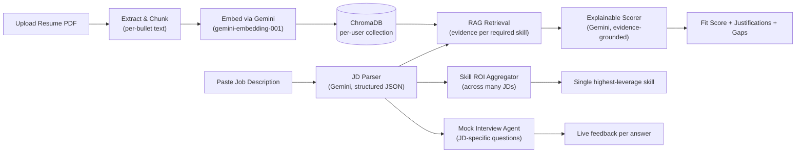

# Candidate Copilot

**AI-powered resume-to-job fit scoring, grounded in evidence — not guesswork.**


> Upload a resume → paste a job description → get an **explainable Fit Score** (skill / domain / experience, each cited to a specific line of your resume) plus the single **highest-leverage skill** to learn next across your whole job search.

- 🚀 **Live demo:** https://candidate-copilot.vercel.app
- 🛠 **API docs:** https://candidate-copilot.onrender.com/docs
- 💻 **Repo:** https://github.com/iamchgopi/candidate-copilot

---

## The problem this solves

Most "resume match" tools return a single number — `78% match` — with no way to check its work. That number could be a real assessment or a hallucination; there's no way to tell. **Candidate Copilot never lets a score exist without the evidence behind it.** Every dimension is retrieved from your actual resume text first, then scored against that specific evidence, then shown to you alongside the score — so you can verify the reasoning, not just trust it.

It also solves a second, rarer problem: **most tools score one job at a time.** If you're applying to 20+ roles, no tool tells you which single skill, if learned, would improve your odds across the most roles at once. Candidate Copilot's **Skill ROI Aggregator** does exactly that — turning your job search into a data set instead of 20 separate, disconnected checks.

## How it works



**Step by step:**

1. **Upload** — any PDF resume is extracted, split into bullet-sized chunks, embedded with Gemini's embedding model, and stored in a ChromaDB collection unique to that visitor (`resume_<random_id>`) — no two people's data ever mixes.
2. **Parse** — a pasted job description is turned into structured JSON: title, seniority, must-have skills, nice-to-have skills, domain, years required, remote status.
3. **Retrieve** — for every required skill, the system searches *your own* resume embeddings for the most relevant supporting evidence.
4. **Score** — Gemini scores skill/domain/experience fit **using only that retrieved evidence**, with a one-line justification per dimension, and lists any skill it couldn't find evidence for as an honest gap.
5. **Aggregate** (optional) — paste a batch of JDs at once, and the same scoring runs across all of them; a simple, deterministic tally (no LLM guessing) finds the one gap skill blocking the most roles.
6. **Practice** (optional) — generate JD-specific mock interview questions and get direct feedback on typed or spoken answers (voice input via the browser's built-in speech recognition, with automatic silence detection).

## Try it yourself

No install needed — the live demo runs entirely in your browser:

👉 **https://candidate-copilot.vercel.app**

1. Upload any resume PDF
2. Paste a real job description → see the fit score and reasoning
3. Paste several JDs separated by a `---` line → see your highest-leverage skill gap
4. Practice a mock interview for that role

**Note:** the free-tier backend sleeps after ~15 minutes of inactivity — the first request after a while may take 30-60 seconds to wake up. This is expected, not broken.

## Why it's genuinely free, not "demo-grade free"

Most AI demo apps idle at $20-30/mo on cloud infrastructure. This one is built to run at real **$0/mo**, indefinitely:

| Layer | Choice | Why it's free |
|---|---|---|
| LLM + embeddings | Google Gemini API (`gemini-3.5-flash-lite`, `gemini-embedding-001`) | Generous daily free quota, no card required |
| Vector database | ChromaDB (embedded, file-based) | Runs in-process — no hosted DB bill |
| Backend hosting | Render (free web service) | Sleeps when idle, wakes on request — $0, some cold-start latency |
| Frontend hosting | Vercel (free static hosting) | Plain HTML/JS, no build step, instant deploys |

**The honest tradeoff:** Render's free tier doesn't persist disk storage across restarts, so uploaded resume data is wiped whenever the backend sleeps and wakes back up. Fine for a portfolio demo; a real product would need a hosted vector store (see Limitations).

## Quickstart (run it locally)

```bash
git clone https://github.com/iamchgopi/candidate-copilot.git
cd candidate-copilot

python -m venv venv
venv\Scripts\activate          # Windows
# source venv/bin/activate     # macOS/Linux

pip install -r requirements.txt

# Get a free key at https://aistudio.google.com/apikey
echo GEMINI_API_KEY=your_key_here > .env

uvicorn api:app --reload --port 8000
```

Then open `index.html` in a browser. It points at the live Render backend by default — change the `API_BASE` constant near the top of the `<script>` block to `http://127.0.0.1:8000` to test fully locally.

## Deploy your own copy (free tier, no card)

**Backend → Render**
1. New Web Service → connect this repo
2. Build command: `pip install -r requirements.txt`
3. Start command: `uvicorn api:app --host 0.0.0.0 --port $PORT`
4. Environment variable: `GEMINI_API_KEY`
5. Instance type: **Free**

**Frontend → Vercel**
1. Import this repo
2. Framework preset: **Other** (it's plain HTML — no build step)
3. Deploy

## Project layout

```
api.py                 FastAPI app — all HTTP routes
jd_parser.py            Gemini client setup + JD → structured JSON
match_agent.py           RAG retrieval + explainable scoring
aggregator.py            Skill ROI Aggregator (deterministic tally, no LLM ranking)
mock_interview.py        Interview question generation + answer feedback
ingest.py                PDF → chunks → Gemini embeddings → ChromaDB (per-user)
resume_extractor.py      PDF text extraction + bullet-point chunking
index.html               Frontend — vanilla HTML/CSS/JS, responsive two-column layout
requirements.txt         Minimal, deployment-tuned dependency list
```

## API surface

| Method | Path | Purpose |
|---|---|---|
| `POST` | `/upload-resume` | Accepts a PDF, extracts + embeds it, returns a new `user_id` |
| `POST` | `/parse-jd` | Parses a job description into structured requirements |
| `POST` | `/match` | Runs the RAG matcher for one JD against one user's resume |
| `POST` | `/analyze-job-search` | Runs the Skill ROI Aggregator across a batch of JDs |
| `POST` | `/interview/question` | Generates the next JD-specific interview question |
| `POST` | `/interview/feedback` | Scores a typed interview answer |

Full interactive docs (Swagger UI) live at `/docs` on the deployed API.

## Design decisions worth knowing

- **Deterministic aggregation, not LLM ranking.** The Skill ROI Aggregator uses simple counting (`collections.Counter`) to find the most common gap across JDs — not an LLM asked to "rank the skills." Counting is exact and auditable; asking an LLM to rank things it already scored would just add noise and cost.
- **Per-user ChromaDB collections, not a shared index.** Every visitor's resume lives in `resume_<their_id>` — a genuinely isolated namespace, not a shared table filtered by a user column. Simpler to reason about, and impossible to leak across visitors by a filtering bug.
- **Gemini for everything, not a mixed stack.** Early versions used a local `sentence-transformers` model for embeddings alongside Gemini for generation — that pulled in `torch`/`transformers` (hundreds of MB), which is a poor fit for a free-tier host with 512MB RAM. Switching to Gemini's embedding API for both jobs kept the whole app lightweight and Render-deployable.

## Limitations & honest future work

- **No persistent storage** — Render's free tier wipes local disk (including ChromaDB) on every sleep/restart, so uploaded resumes only last until the next sleep cycle. A free-tier hosted vector store (e.g. Supabase pgvector) would fix this at no added cost.
- **No auth or rate limiting yet** — endpoints are public. A `slowapi` limiter on `/upload-resume` and `/match` is a natural next addition.
- **LLM scoring isn't perfectly deterministic** — identical repeated runs can vary by 5-15 points. This is inherent to LLM-based scoring, not a bug; a future version could show a score range instead of a single number to be transparent about this.
- **`/match` re-parses the JD internally**, duplicating the `/parse-jd` call the frontend already made for display. Refactoring `/match` to accept an already-parsed JD would save one Gemini call per request.
- **Cold starts** — the first request after ~15 minutes of inactivity takes 30-60s while Render wakes the free instance. A lightweight keepalive ping (or a paid instance) would remove this.
- **Voice input works in Chrome/Edge only** — the mock interview's microphone feature uses the browser's native Web Speech API, which Safari and Firefox don't support. Those browsers fall back to typing, with a clear message rather than a silent failure.
- **An MCP server wrapping this API** would let the whole pipeline run directly from Claude Desktop or Claude Code — a natural next step for anyone extending this.

## License

MIT — free to use, fork, and adapt.
